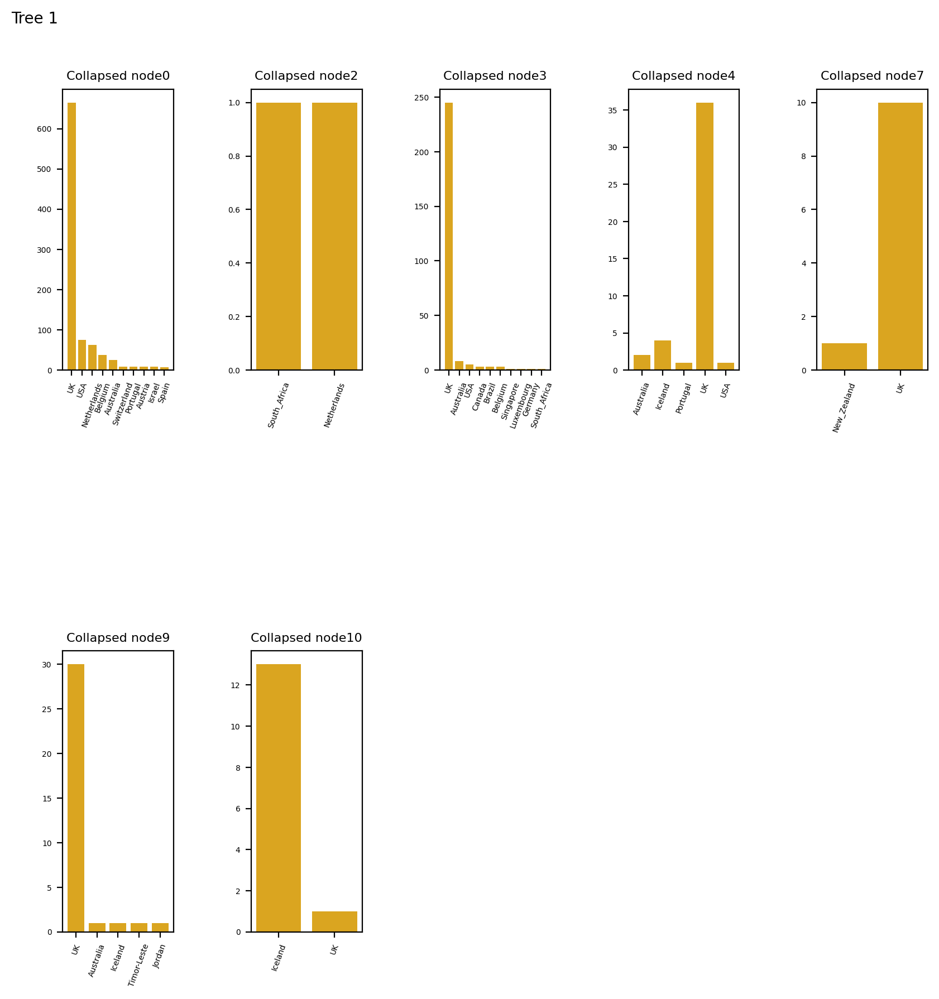
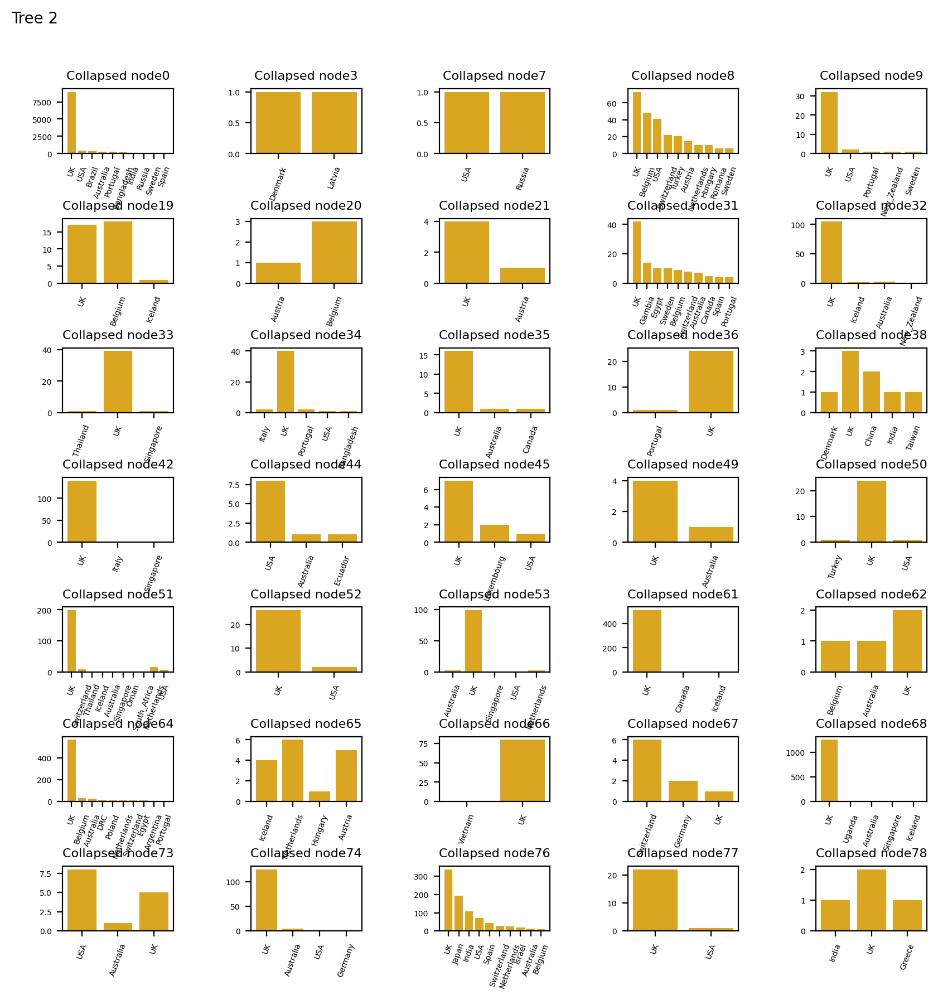

# Local lineage report

10 sequences were provided in total.
7 were found in the database, leaving 3 which were not.

The table below is a summary of these sequences provided with metadata, along with the global lineage they have been assigned.

| Query ID                      | Sample date   | Closest sequence in Tree   | Global lineage   | Tree   |
|:------------------------------|:--------------|:---------------------------|:-----------------|:-------|
| Austria/CeMM0170/2020_closest | NA            | Austria/CeMM0169/2020      | B.1.1.6          | Tree 2 |
| Austria/CeMM0171/2020_closest | NA            | Austria/CeMM0176/2020      | B.1.1.6          | Tree 2 |
| Austria/CeMM0172/2020         | 2020-03-07    | NA                         | B.1.1.6          | Tree 2 |
| Austria/CeMM0175/2020         | 2020-03-08    | NA                         | B.1.1.6          | Tree 2 |
| Austria/CeMM0176/2020         | 2020-03-08    | NA                         | B.1.1.6          | Tree 2 |
| Iceland/422/2020_closest      | NA            | Iceland/459/2020           | B.2.7            | Tree 1 |
| Iceland/421/2020              | 2020-03-19    | NA                         | B.2.7            | Tree 1 |
| Iceland/417/2020              | 2020-03-19    | NA                         | B.2.7            | Tree 1 |
| Iceland/414/2020              | 2020-03-19    | NA                         | B.2.7            | Tree 1 |
| Iceland/413/2020              | 2020-03-19    | NA                         | B.2.7            | Tree 1 |

## Phylogenies

The nearest neighbours of each of the query sequences are shown below to enable the assessment of monophyly.

Tree number 1 contains 5 queries.
   

Tree number 2 contains 5 queries.
   

## Tree background

The following plots describe the location of the sequences in the collapsed nodes.
If more than one country was present, the bar chart describes the number of sequences present in each country. 
Where there were 10 countries or more, the largest 10 have been taken. 

### Software versions

This report was made using:

Python 3.6.11
Matplotlib version 3.3.0
Pandas version 1.0.1
Tabulate version 0.8.7
CSV version 1.0
Numpy version 1.19.1
Scipy version 1.5.2
Baltic
llama version is 0.1

### Acknowledgements

This report was generated by llama.

Tree data was visualised using baltic (https://github.com/evogytis/baltic)

